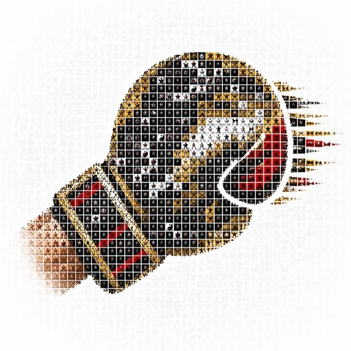
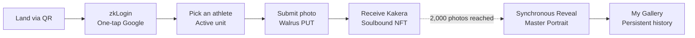
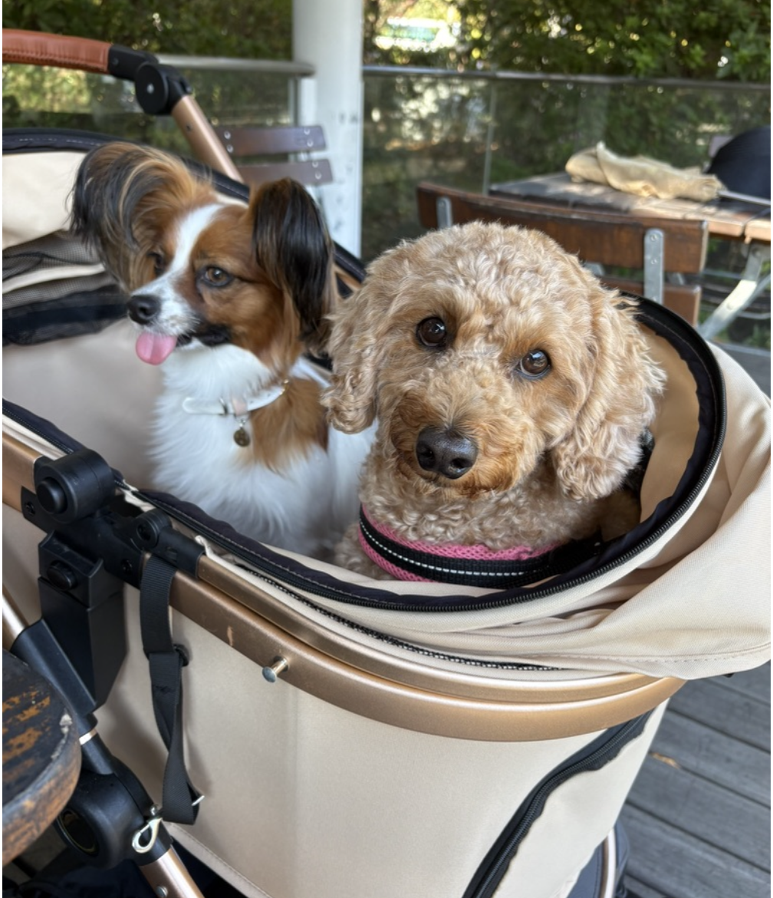

<div align="center">



# ONE Portrait — The Faces of Fans

### *Your smile becomes their strength.*

[](https://luma.com/suionesamurai)
[](https://sui.io/)
[](https://www.walrus.xyz/)
[](https://nextjs.org/)
[](https://opennext.js.org/)
[](#-license)

</div>

ONE Portrait is a non-profit, on-chain co-creation experience: **2,000 ONE Championship fans each upload a single photo**, and the moment the 2,000th lands, **a single high-resolution mosaic portrait of an athlete is revealed simultaneously** to everyone — and a soulbound "Kakera" NFT carrying their own tile is minted to each participant. Until that moment, the full image stays hidden; only a remaining-photo counter is shared, so everyone witnesses the reveal together.

---

<div align="center">


<sub>2,000 fan photos → one revealed mosaic portrait.</sub>

</div>

---

## 🎯 The Problem & The Insight

Existing fan goods and athlete NFTs lean heavily into **ownership** or **speculation**. There is no mechanism that preserves the enthusiasm of each individual fan *as part of the artwork itself*. ONE Portrait answers that gap by **weaving 2,000 fans' everyday photos into a single portrait**, turning collective support into a tamper-proof, on-chain, co-created piece of art.

This project is a direct answer to the hackathon theme — **"a new way to connect ONE Championship and Japanese fans / a mechanism to close the distance between athletes and their fans"** — implemented in a way only Sui, Walrus, and Move make possible. The non-profit, soulbound design also aligns naturally with ONE Samurai's values of *respect, courage, integrity, and humility*.

- 🥋 **On-theme:** A direct response to the official hackathon theme of bridging ONE Championship and Japanese fans, and shrinking the distance between athletes and their supporters.
- 🤝 **Aligned with Samurai values:** A non-transferable, non-profit Soulbound design embodies *respect, integrity, and humility*.
- 🎁 **Reward to the fans:** The completed Master Portrait goes to the athlete (operations); each Kakera goes to the participating fan. The NFT is a **proof of presence**, not an instrument of speculation.

---

## ✨ Key Features

| | Feature | Description |
| :---: | :--- | :--- |
| 🟦 | **Zero-Friction Onboarding** | zkLogin (Google) + Enoki **Sponsored Transactions**. No wallet, no SUI tokens required — participate with the same UX as any Web2 app. |
| 🎭 | **Synchronous Reveal** | The full image stays hidden until the 2,000th photo lands. Only the remaining-photo counter is shared during the run, so **the completed portrait reveals on every participant's screen at the same instant**. |
| 💎 | **Soulbound Proof-of-Participation** | Move's capability design (`key` only, no `store`) makes the Kakera NFT **non-transferable at the type level** — proof of fandom that cannot be resold. |
| 🖼 | **On-Chain History** | A simple Sui query over the holder's Kakera fully reconstructs their participation history. **No off-chain database needed** — the SBT itself is the source of truth. |

---

## 🎬 Demo

<!-- DEMO:TODO -->
- 🌐 **Live Demo:** `<https://TODO>` <!-- DEMO:TODO -->
- 🎥 **Walkthrough Video (3min):** `<https://TODO>` <!-- DEMO:TODO -->
- 🖼 **Screenshots:** `docs/img/01-landing.png` / `02-reveal.png` / `03-gallery.png` <!-- DEMO:TODO -->

---

## 🔄 How It Works



1. **Land** — arrive via a venue or social-media QR code.
2. **zkLogin** — sign in with Google; a Sui address is provisioned on the spot.
3. **Pick an athlete** — choose the active unit (2,000 tiles) for the athlete you want to support.
4. **Submit a photo** — after consenting to original-image publication, the browser resizes and strips EXIF, then PUTs directly to Walrus.
5. **Receive Kakera** — in the same transaction as `submit_photo`, a Soulbound NFT bearing your `submission_no` is minted to your address.
6. **Reveal** — when the 2,000th photo lands, a browser-distributed trigger calls finalize, the mosaic is generated, and the full image goes public on every screen at once.
7. **My Gallery** — return any time; the participation history is auto-restored from your Kakera. Even if the original photo cannot be retrieved, the completed artwork and the tile metadata persist.

---

## 🖼 What a Submission Looks Like

<table align="center">
  <tr>
    <td align="center" width="50%">
      
      <br />
      <sub>A fan's photo</sub>
    </td>
    <td align="center" width="50%">
      
      <br />
      <sub>…becomes one tile in the mosaic.</sub>
    </td>
  </tr>
</table>

---

## 🏗 Architecture

```
[ Browser  Next.js + OpenNext on Cloudflare Workers ]
        │  zkLogin → image preprocessing → direct PUT to Walrus
        │  submit_photo PTB (Sponsored, Kakera minted in the same Tx)
        │  Subscribe to Submitted / UnitFilled / MosaicReady via Sui WS
        │  On UnitFilled → POST /api/finalize
        ▼
[ Sui Testnet  Move package: one_portrait ]
        ├─ Registry (shared)        unit_ids
        ├─ Unit (shared)            display_name / target blob / submitters / submissions / status / master_id?
        ├─ MasterPortrait           placements: Table<blob_id, Placement>
        └─ Kakera (Soulbound)       blob_id / submission_no / unit_id

[ Walrus ]      2,000 fan-uploaded photos (epochs=5, no long-term guarantee in MVP) + 1 completed mosaic (epochs=100)
[ Cloudflare ]  Finalize Worker ─▶ External Mosaic Generator
[ manji PC ]    Node/TypeScript generator + Cloudflare Tunnel
```

For the full component and sequence diagrams, see [`docs/tech.md` §1](docs/tech.md).

---

## ⛓ Why Sui × Walrus

| Highlight | Why it matters |
| :--- | :--- |
| **Persistent storage on Walrus** | The completed mosaic and the target image are stored on decentralized storage. Fan-uploaded originals are referenced by `blob_id` as the canonical identifier, with no long-term availability guarantee at the MVP stage. |
| **Reverse lookup via Sui `Table`** | `MasterPortrait.placements: Table<blob_id, Placement>` resolves `blob_id → tile placement` **on-chain at low gas cost**. We avoid hard-coding 2,000 entries inside the NFT object. |
| **Soulbound enforced by type** | Kakera uses Move's capability design (`key` only, no `store`) so it is **non-transferable at compile time** — a type-level guarantee, not a runtime check. |
| **zkLogin + Sponsored Tx** | With Enoki, users only sign in with Google. `submit_photo` is sponsored by operations and locked to a tightly scoped `moveCallTargets`. Full participation with zero SUI required. |
| **Browser-distributed trigger** | Detection of `UnitFilled` and the call to `/api/finalize` are **handled by participant browsers**. No long-running listener, cron, or queue. Idempotency is enforced on the Move side (`status == Filled && master_id.is_none()`), so concurrent triggers collapse to exactly one successful finalize. |
| **All gas is sponsored** | Every fan transaction goes through Enoki Sponsored Transaction. Only `finalize` is paid by the AdminCap-holding operator address. |

---

## 📦 Tech Stack

| Layer | Technology |
| :--- | :--- |
| Frontend | Next.js (App Router, TypeScript) |
| Hosting | Cloudflare Workers + OpenNext (`@opennextjs/cloudflare`) |
| UI / Motion | Tailwind CSS + shadcn/ui + Framer Motion |
| Web3 Auth | zkLogin (Sui) + Enoki |
| Sui SDK | `@mysten/sui` (PTB / event subscriptions) |
| Storage | Walrus (Publisher / Aggregator HTTP API) |
| Smart Contract | Sui Move — single package `one_portrait` |
| Backend | Cloudflare Worker + external Node/TypeScript generator on the `manji` PC (`sharp` / `libvips`) |
| Runtime | Node.js 20+ / pnpm workspace |

---

## 🧱 Repo Layout

```text
one_portrait/
├── apps/web/        Next.js App Router foundation
├── contracts/       Move package `one_portrait`
├── generator/       Finalize generator that runs on the `manji` PC
├── shared/          Shared types and constants between Web and Generator
├── docs/            Specifications
└── scripts/         Development helper scripts
```

At this point, `apps/web` and `generator` contain only a minimal TypeScript skeleton.
`contracts` ships a Move-package skeleton.

---

## 🛠 Development

### JavaScript / TypeScript

```bash
corepack pnpm install
corepack pnpm run dev
corepack pnpm run dev:demo
corepack pnpm run dev:e2e
corepack pnpm run dev:smoke
corepack pnpm run test:e2e
corepack pnpm run test:e2e:readiness
corepack pnpm run check
corepack pnpm --filter web build
```

- Public web env vars start from `apps/web/.env.example`.
- The root `check` script runs workspace-wide `typecheck` and `test` together.

### Run modes

| Command | Purpose | Behavior |
| :--- | :--- | :--- |
| `corepack pnpm run dev` | Regular development | Uses `apps/web/.env.local` as-is. If E2E stub values are still present, startup is aborted. |
| `corepack pnpm run dev:demo` | Visual UI check | Uses demo fixtures so top / waiting room / gallery can be verified without external dependencies. The waiting-room Google login is for layout verification only — no real login or submission happens. |
| `corepack pnpm run dev:e2e` | Web server for Playwright | Injects E2E stub env vars into the child process only. `.env.local` is not modified. |
| `corepack pnpm run test:e2e:readiness` | Pre-demo regression check | Bundles only the regression checks for `#23` `#24` `#25` as a stub E2E run. Live-send verification for `#22` is not included. |
| `corepack pnpm run dev:smoke` | Pre-demo live-send check | Starts Next.js with the real env intact and walks Google login / Walrus / Sponsored submit / Kakera verification by hand. The procedure and evidence trail live in `docs/demo-smoke.md`. |
| `corepack pnpm run test:e2e` | Run Playwright | Runs the browser tests via `dev:e2e`. The regular development env is not contaminated. |

### Move

```bash
cd contracts
sui move build
sui move test --test
sui move test --list --test
```

- Standalone Move test modules go under `contracts/tests/`. `contracts/sources/` keeps only production modules and `#[test_only]` helpers.
- As `sui move test --help` shows, the canonical command that includes `contracts/tests/` is `sui move test --test`.
- On environments without the `sui` CLI, inspect `contracts/Move.toml` and the skeletons under `contracts/{sources,tests}/`.
- The devcontainer in this repo includes Node, but the `sui` CLI must be installed separately.

---

## 📚 Further Reading

- 📘 [`docs/spec.md`](docs/spec.md) — Product / experience specification (target users, functional requirements, flow, rationale for using Sui and Walrus).
- 🛠 [`docs/tech.md`](docs/tech.md) — Technical specification (architecture, sequence diagrams, Move, Frontend, Backend, consistency, security).
- ✅ [`docs/demo-smoke.md`](docs/demo-smoke.md) — Pre-demo runbook for performing one live end-to-end submission.
- 🚦 [`docs/finalize-generator-runbook.md`](docs/finalize-generator-runbook.md) — Generator startup, Cloudflare Tunnel, and recovery procedures.
- ✅ [`docs/demo-seeding.md`](docs/demo-seeding.md) — Pre-demo seeding runbook for pre-loading 1,999 submissions.

---

<div align="center">

<sub>Built for the Sui × ONE Samurai Hackathon, April 2026.</sub>

</div>
