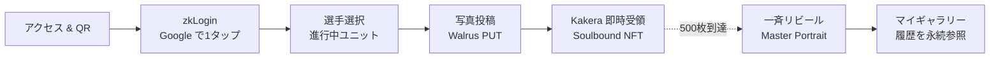

<div align="center">

# ONE Portrait — The Faces of Fans

### あなたの笑顔が、ヒーローの力になる
#### *Your Smile Becomes Their Strength*

[](https://luma.com/suionesamurai)
[](https://sui.io/)
[](https://www.walrus.xyz/)
[](https://nextjs.org/)
[](https://opennext.js.org/)
[](#-license)

</div>

ONE Championship のファン **500人がそれぞれ1枚ずつ写真を投稿**し、**1枚の選手モザイク肖像画**を共同制作する非営利プロジェクト。完成までモザイク全体は伏せられ、500枚到達の瞬間に**全員一斉にリビール**される。各参加者には自分の担当マスを刻んだSoulbound NFT「欠片 (かけら / Kakera)」が永久に届く。

> A non-profit, on-chain co-creation experience: 500 ONE Championship fans each upload one photo, and the moment the 500th lands, a single high-resolution mosaic portrait of an athlete is revealed simultaneously to everyone — and a soulbound "Kakera" NFT carrying their own tile is minted to each participant.

---

## 🎯 The Problem & The Insight / なぜ今これを作るのか

既存のファングッズや選手NFTは「**所有**」か「**投機**」に偏重しており、ファン一人ひとりの熱狂を *作品そのものとして残す* 仕組みは存在しない。ONE Portrait は、**500人のファンの日常写真を1枚の肖像画に編み込む**ことで、応援の熱量を**改ざん不可能なオンチェーン共同制作アート**として永続化する。

This project is a direct answer to the hackathon theme — **"a new way to connect ONE Championship and Japanese fans / a mechanism to close the distance between athletes and their fans"** — implemented in a way only Sui, Walrus, and Move make possible. The non-profit, soulbound design also aligns naturally with ONE Samurai's values of *respect, courage, integrity, and humility*.

- 🥋 **テーマ適合性:** ハッカソン公式テーマ「ONE Championship と日本のファンをつなぐ / アスリートとファンの距離を縮める」への直球回答。
- 🤝 **Samurai 価値観との整合:** 譲渡不可・非営利の Soulbound 設計は「リスペクト・誠実さ・謙虚さ」の体現。
- 🎁 **ファンへの還元:** 完成 Master Portrait は選手（運営）に、各 Kakera は参加ファンへ。投機ではなく**証**としてのNFT。

---

## ✨ Key Features / 主な特徴

| | Feature | 説明 |
| :---: | :--- | :--- |
| 🟦 | **摩擦ゼロ参加 / Zero-Friction Onboarding** | zkLogin (Google) + Enoki **Sponsored Transaction**。ウォレットも SUI トークンも不要。Web2 と同じUXで参加可能。 |
| 🎭 | **リビール演出 / Synchronous Reveal** | 500枚到達まで全体像は非公開。残り枚数カウンターのみで進捗を共有し、**完成の瞬間に全参加者の画面で同時にリビール**。 |
| 💎 | **Soulbound 欠片NFT / Tamper-Proof Proof-of-Participation** | Move の能力設計（`key only` / `store` 不付与）で**型レベルに譲渡を禁止**。転売不可の「ファンの証」。 |
| 🖼 | **マイギャラリー / On-Chain History** | 保有 Kakera を Sui からクエリするだけで参加履歴を完全復元。**オフチェーンDB不要**、SBT そのものが正本。 |

---

## 🎬 Demo

<!-- DEMO:TODO -->
- 🌐 **Live Demo:** `<https://TODO>` <!-- DEMO:TODO -->
- 🎥 **Walkthrough Video (3min):** `<https://TODO>` <!-- DEMO:TODO -->
- 🖼 **Screenshots:** `docs/img/01-landing.png` / `02-reveal.png` / `03-gallery.png` <!-- DEMO:TODO -->

---

## 🔄 How It Works / 体験フロー



1. **アクセス** — 会場/SNSのQRから着地。
2. **zkLogin** — Google アカウントで認証、Sui アドレスがその場で発行。
3. **選手選択** — 参加したい選手の進行中ユニット (500マス) を選ぶ。
4. **写真投稿** — 原画像公開性に同意したうえで、ブラウザでリサイズ+EXIF除去 → Walrus に直接 PUT。
5. **Kakera 即時受領** — `submit_photo` と同一 Tx で `submission_no` 付き Soulbound NFT が自分のアドレスに mint。
6. **リビール** — 500枚目着弾 → ブラウザ分散トリガーが finalize 起動 → モザイク生成 → 全画面同時公開。
7. **マイギャラリー** — 後日アクセスすれば、保有 Kakera から参加履歴が自動復元。元写真が取得できない場合でも、完成作品と欠片情報は残る。

---

## 🏗 Architecture / 構成

```
[ Browser  Next.js + OpenNext on Cloudflare Workers ]
        │  zkLogin → 画像前処理 → Walrus 直接 PUT
        │  submit_photo PTB (Sponsored, Kakera即時 mint)
        │  Sui WS で Submitted / UnitFilled / MosaicReady を購読
        │  UnitFilled 検知 → POST /api/finalize
        ▼
[ Sui Testnet  Move package: one_portrait ]
        ├─ Registry (shared)        athlete_id -> current_unit_id
        ├─ Unit (shared)            athlete_id / target blob / submitters / submissions / status / master_id?
        ├─ MasterPortrait           placements: Table<blob_id, Placement>
        └─ Kakera (Soulbound)       blob_id / submission_no / unit_id

[ Walrus ]      ファン投稿 500枚 (epochs=5, MVPでは長期保証なし) + 完成モザイク 1枚 (epochs=100)
[ Cloudflare ]  Finalize Worker ─▶ Mosaic Generator Container (on-demand)
```

詳細なコンポーネント図とシーケンス図は [`docs/tech.md` §1](docs/tech.md) を参照。

---

## ⛓ Why Sui × Walrus / 技術的ハイライト

| ハイライト | 意義 |
| :--- | :--- |
| **Walrus による永続保存** | 完成モザイクと目標画像を分散ストレージに保存。ファン投稿原画像は `blob_id` を正本識別子として保持しつつ、MVPでは長期可用性を保証しない。 |
| **Sui `Table` で逆引き正本化** | `MasterPortrait.placements: Table<blob_id, Placement>` により blob_id → 配置座標を**ガス低コストでオンチェーン解決**。NFT 内部に 500件をベタ書きしないスマート設計。 |
| **Soulbound を型で保証** | Kakera は Move の能力設計 (`key only`、`store` 不付与) で**コンパイル時から譲渡不能**。実行時チェックではなく型レベルで担保。 |
| **zkLogin + Sponsored Tx** | Enoki でユーザーは Google ログインのみ。`submit_photo` は運営が Sponsored で gas 負担、`moveCallTargets` で対象を厳格に絞る。SUI 保有ゼロでフル参加。 |
| **ブラウザ分散トリガー** | `UnitFilled` 検知 → `/api/finalize` 起動を**参加者ブラウザが担う**。常駐 Listener / Cron / Queue 不要。冪等性は Move 側 (`status == Filled && master_id.is_none()`) で担保し、同時多重発火を 1件だけ成功させる。 |
| **Gas はすべて Sponsored** | ファンの全 Tx は Enoki Sponsored Transaction。`finalize` のみ AdminCap 保有運営アドレスが自己負担。 |

---

## 📦 Tech Stack

| レイヤー | 技術 |
| :--- | :--- |
| Frontend | Next.js (App Router, TypeScript) |
| Hosting | Cloudflare Workers + OpenNext (`@opennextjs/cloudflare`) |
| UI / 演出 | Tailwind CSS + shadcn/ui + Framer Motion |
| Web3 認証 | zkLogin (Sui) + Enoki |
| Sui SDK | `@mysten/sui` (PTB / イベント購読) |
| Storage | Walrus (Publisher / Aggregator HTTP API) |
| Smart Contract | Sui Move — 単一パッケージ `one_portrait` |
| Backend | Cloudflare Worker + on-demand Container (sharp / libvips) |
| Runtime | Node.js 20+ / pnpm workspace |

---

## 🧱 Repo Layout

```text
one_portrait/
├── apps/web/        Next.js App Router の土台
├── contracts/       Move package `one_portrait`
├── generator/       モザイク生成コンテナの入口
├── shared/          Web / Generator 共通の型と定数
├── docs/            仕様書
└── scripts/         開発補助スクリプト
```

現時点では、`apps/web` と `generator` は最小の TypeScript 土台です。
`contracts` は Move package の雛形までを置いています。

---

## 🛠 Development

### JavaScript / TypeScript

```bash
corepack pnpm install
corepack pnpm run check
corepack pnpm --filter web build
```

- Web の公開環境変数は `apps/web/.env.example` を起点に用意します
- root の `check` は workspace 全体の `typecheck` と `test` をまとめて実行します

### Move

```bash
cd contracts
sui move build
sui move test
```

- `sui` CLI が入っていない環境では、`contracts/Move.toml` と `contracts/sources/` の雛形を確認してください
- 本リポジトリの devcontainer には Node は入っていますが、`sui` CLI は別途用意が必要です

---

## 🚀 Demo Ops Runbook

この章は、ハッカソン提出前に必要な運用手順を 1 本にまとめたものです。
デモ基準は **500 枚 1 unit** です。現場で 500 枚を集めきれないときは、無理に本番フローへ寄せず、事前生成結果やモックを使います。

### 1. 役割ごとの設定値を分ける

`apps/web/.env.example` を起点に、値の置き場を次の 3 つに分けます。

| 置き場 | 主な値 | 用途 |
| :--- | :--- | :--- |
| `apps/web/.env.local` | `NEXT_PUBLIC_*`, `ENOKI_PRIVATE_API_KEY` | ローカル確認と `next dev` 用 |
| Cloudflare Secrets Store | `ADMIN_CAP_ID`, `ADMIN_SUI_PRIVATE_KEY` | `finalize` と generator container 用 |
| publish 結果のメモ | `PACKAGE_ID`, `Registry` object ID, `AdminCap` ID | testnet 反映後に転記する元情報 |

- `NEXT_PUBLIC_E2E_STUB_WALLET` は Playwright 専用です。通常運用では空欄のままにします。
- `ADMIN_SUI_PRIVATE_KEY` は運用者専用です。`.env.local` にコミットしません。
- `PACKAGE_ID` と `AdminCap` ID は `sui client publish contracts` の出力から控えます。
- `Registry` は package publish 時に shared object として作られます。

### 2. ローカルで止まらないことを先に確認する

```bash
corepack pnpm install
corepack pnpm run check
corepack pnpm --filter web run build
corepack pnpm --filter web run test:bundle-size
cd contracts && sui move build && sui move test
```

- `corepack pnpm run check` は workspace 全体の lint、typecheck、test をまとめて見ます。
- `test:bundle-size` は OpenNext build と `wrangler deploy --dry-run` を含む非破壊チェックです。
- `test:bundle-size` と `deploy` は Docker CLI と daemon が必要です。Wrangler が container binding を dry-run でも確認するためです。
- Cloudflare のプレビュー導線まで見たいときだけ `corepack pnpm --filter web run preview` を使います。

### 3. testnet に反映して ID を固定する

```bash
cd contracts
sui client publish .
```

publish 後に次を控えます。

- `PACKAGE_ID`
- shared object として作られた `Registry` object ID
- 運営ウォレットへ返る `AdminCap` ID

そのあとで `apps/web/.env.local` と Cloudflare 側へ転記します。

- `NEXT_PUBLIC_PACKAGE_ID` に `PACKAGE_ID`
- `NEXT_PUBLIC_REGISTRY_OBJECT_ID` に `Registry` object ID
- `ADMIN_CAP_ID` に `AdminCap` ID

### 4. デモ用 unit を作る

デモ用の進行中 unit は、Move の管理 API で先に作ります。

- unit 作成は `one_portrait::admin_api::create_unit`
- 現在 unit の差し替えは `one_portrait::admin_api::rotate_current_unit`
- リビール確定は `one_portrait::admin_api::finalize`

運用で先に決める値は次の 3 つです。

- `athlete_id`
- `target_walrus_blob`
- `max_slots=500`

デモ当日は、対象選手と target 画像の blob を先に決めてから unit を作ります。`rotate_current_unit` は差し替えが必要なときだけ使います。

### 5. Cloudflare へ反映する

```bash
corepack pnpm --filter web run deploy
```

- deploy 前に Cloudflare 側へ `ADMIN_CAP_ID` と `ADMIN_SUI_PRIVATE_KEY` を入れます。
- `deploy` script は OpenNext build のあとに `opennextjs-cloudflare deploy -- --keep-vars` を実行します。
- `deploy` 実行端末には Docker CLI と daemon が必要です。
- binding を変えたときだけ `corepack pnpm --filter web run cf-typegen` を追加で回します。

### 6. モックを使う線を先に決める

500 枚のライブ投入を当日にやり切れない場合は、ここで方針を固定します。

- UI の安全確認は `corepack pnpm --filter web run test:e2e` を使います。
- Playwright は `apps/web/scripts/e2e-dev.sh` と `apps/web/tests/e2e/fixtures/mock-network.ts` の stub を使います。
- 会場デモでは「本物で見せる部分」と「事前生成で見せる部分」を分けます。
- 本物で通す候補は、トップ表示、1 回のログイン、1 回の投稿、1 回の finalize です。
- 重い部分は、事前投入した投稿データや生成済みアセットで置き換えて構いません。

### 7. 提出前チェックリスト

- [ ] `corepack pnpm run check` が通る
- [ ] `corepack pnpm --filter web run build` が通る
- [ ] `corepack pnpm --filter web run test:bundle-size` が通る
- [ ] `cd contracts && sui move build && sui move test` が通る
- [ ] `PACKAGE_ID`、`Registry` object ID、`AdminCap` ID を控えた
- [ ] Cloudflare Secrets Store に `ADMIN_CAP_ID` と `ADMIN_SUI_PRIVATE_KEY` を入れた
- [ ] README の手順どおりに local -> testnet -> Cloudflare を追える
- [ ] 本物で見せる部分とモックで見せる部分を事前に決めた

---

## 📚 Further Reading

- 📘 [`docs/spec.md`](docs/spec.md) — プロダクト・体験仕様（ユーザー層 / 機能要件 / フロー / Sui・Walrus 活用意義）
- 🛠 [`docs/tech.md`](docs/tech.md) — 技術仕様（アーキテクチャ / シーケンス図 / Move / Frontend / Backend / 整合性 / セキュリティ）
