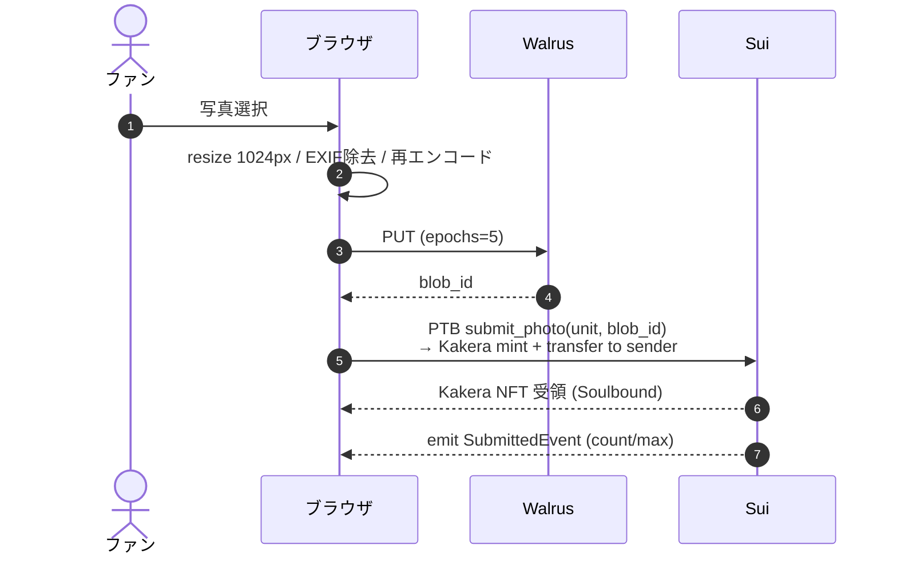
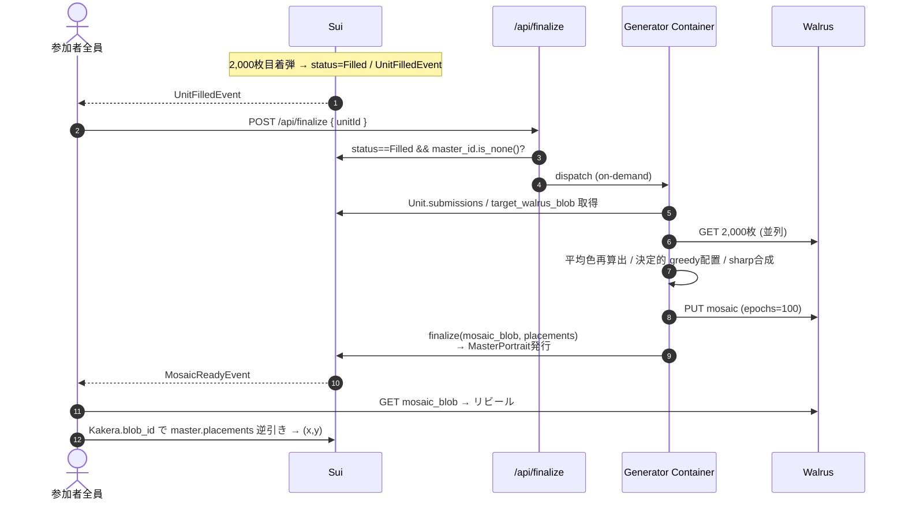

# tech.md: ONE Portrait 技術仕様書

> **目的:** `docs/spec.md` の要件を実現するための技術仕様。各レイヤーの責務とインターフェースを定義する。

---

## 1. アーキテクチャ

### 1.1 設計原則
- **オンチェーン主・運用メタ最小:** 正本（参加履歴・モザイク配置）は Sui オブジェクト。イベントは通知用に限定し、復元の正本には使わない。オフチェーンDBは持たない。
- **Kakera は投稿時に即時発行:** `submit_photo` と同一 Tx で Kakera NFT をファンへ mint。座標は持たず、完成後に Master の `placements` を blob_id で逆引きして解決。finalize での一括 mint を回避。
- **ブラウザ分散トリガー:** `UnitFilled` 検知と finalize 起動は参加者ブラウザが担う。常駐 Listener / Cron / Queue に依存しない。冪等性は Move 側 (`status == Filled && master_id.is_none()`) で担保。
- **Soulbound は Move の型で保証:** Kakera は `store` 能力を付与せず、発行後の譲渡を型レベルで禁止。
- **Gas は Sponsored Transaction:** ユーザーの `submit_photo` 等はすべて Enoki の Sponsored Transaction で運営が gas 負担。ファンは SUI 保有不要、Web2 体験を維持。`finalize` は AdminCap キーが自己負担。
- **選手メタは off-chain / unit 発見は on-chain:** 選手名・画像などの表示メタデータは web の catalog で持ち、on-chain では `athlete_id: u16` と `Registry` による `athlete_id -> current_unit_id` の参照だけを持つ。
- **MVPの原画像保持は限定保証:** 完成モザイクと on-chain 記録は残す。ファン投稿原画像は `blob_id` を正本識別子として保持するが、ハッカソンMVPでは長期可用性を保証しない。

### 1.2 コンポーネント構成

```
[ブラウザ (Next.js / OpenNext / Cloudflare Workers)]
   │  zkLogin → 画像前処理 → Walrus 直接PUT → submit_photo PTB (Kakera即時発行)
   │  Sui WebSocket で Submitted / UnitFilled / MosaicReady を購読
   │  UnitFilled 検知 → POST /api/finalize
   ▼
[Sui Testnet: Move package one_portrait]
   ├─ Registry (shared): athlete_id -> current_unit_id
   ├─ Unit (shared): athlete_id / target_walrus_blob / 状態 / submitters / submissions / master_id?
   ├─ MasterPortrait (運営保有, 将来選手移管): placements Table<blob_id, Placement>
   └─ Kakera (Soulbound, ファン保有): blob_id, submission_no, unit_id

[Walrus] ファン投稿2,000枚 + 完成モザイク1枚
[Cloudflare] Finalize Worker ──▶ External Mosaic Generator
                               (manji PC + Cloudflare Tunnel)
```

### 1.3 シーケンス

#### 1.3.1 投稿フロー


#### 1.3.2 2,000枚到達〜リビール


---

## 2. 技術スタック

| レイヤー | 技術 |
| :--- | :--- |
| フロントエンド | Next.js (App Router, TypeScript) |
| ホスティング | Cloudflare Workers + OpenNext (`@opennextjs/cloudflare`) |
| UI / 演出 | Tailwind CSS + shadcn/ui / Framer Motion |
| Web3認証 | zkLogin (Sui) + Enoki |
| Sui SDK | `@mysten/sui` (PTB / イベント購読) |
| ストレージ | Walrus (Publisher / Aggregator HTTP API) |
| コントラクト | Sui Move (単一パッケージ `one_portrait`) |
| バックエンド | Cloudflare Worker + external Node/TypeScript generator on `manji` PC (`sharp` / `libvips`) |
| 実行環境 | Node.js 20+ / pnpm workspace |

---

## 3. モノレポ構成

```
one_portrait/
├── apps/
│   └── web/                  # Next.js (OpenNext → Cloudflare Workers)
│       └── src/{app, lib/{sui,walrus,zklogin,image}, components/ui}
├── contracts/                # Move package root (`sui move new` をここで実行)
│   ├── Move.toml
│   ├── sources/              # 本番モジュール + `#[test_only]` helper
│   └── tests/                # 独立した `#[test_only]` test modules
├── generator/                # `manji` PC 上で動かす finalize generator
├── shared/                   # Web / Generator 共有の型・定数
└── docs/{spec,tech}.md
```

---

## 4. スマートコントラクト (Move)

### 4.1 パッケージ `one_portrait`
単一パッケージ／複数モジュール。ユニットサイズは `max_slots` でパラメータ化し、本番・デモともに **2,000 固定**（デモは Mock データを事前投入）。

### 4.2 モジュールと責務

| モジュール | 主要型 | 責務 |
| :--- | :--- | :--- |
| `registry` | `Registry` (shared) | `athlete_id -> current_unit_id` を保持し、各選手の進行中 unit 発見を一意にする。 |
| `unit` | `Unit` (shared), `SubmissionRef` | `athlete_id`、`target_walrus_blob`、進捗カウンター、`submitters` Table による重複チェック、順序付き `submissions`、`status` 遷移、`master_id` 保持。公開 API から委譲される内部状態遷移を担う。 |
| `kakera` | `Kakera` (key only, Soulbound) | ファン投稿時に即時 mint → sender へ transfer。`{ unit_id, athlete_id, submitter, walrus_blob_id, submission_no, minted_at_ms }` を保持。座標は持たない。 |
| `master_portrait` | `MasterPortrait` (key+store), `Placement` | 完成モザイクNFT。`placements: Table<blob_id, Placement>` で blob_id → `(x, y, submitter, submission_no)` を逆引き可能にする。MVPは運営保有、将来選手移管。 |
| `events` | `SubmittedEvent` / `UnitFilledEvent` / `MosaicReadyEvent` | クライアント購読用。進捗表示・リビール遷移のトリガー。 |
| `admin_api` | - | 管理者向け `create_unit` / `rotate_current_unit` / `finalize` のみを公開し、配置入力の構築は package 内 helper に閉じる。 |
| `accessors` | - | ファン向け公開 API を `submit_photo` と `current_unit_id` に限定する。 |

### 4.3 データモデル
- `Registry`
  - shared object。`current_units: Table<u16, ID>` を持ち、各 `athlete_id` の現在の `Unit` を指す。
- `Unit`
  - `athlete_id: u16`
  - `target_walrus_blob`
  - `max_slots`
  - `status`
  - `master_id: Option<ID>`
  - `submitters: Table<address, bool>`
  - `submissions: vector<SubmissionRef>`
- `SubmissionRef`
  - `submission_no`
  - `submitter`
  - `walrus_blob_id`
  - `submitted_at_ms`
- `Kakera`
  - `unit_id`
  - `athlete_id`
  - `submitter`
  - `walrus_blob_id`
  - `submission_no`
  - `minted_at_ms`
- `Placement`
  - `x`
  - `y`
  - `submitter`
  - `submission_no`

### 4.4 状態遷移
`Pending (0..1,999) → Filled (2,000到達) → Finalized (Masterミント済)`

### 4.5 権限
- `create_unit` / `rotate_current_unit`: `AdminCap` 保有者のみ。次 unit は自動生成せず、運営が `Registry` を更新する。
- `submit_photo`: 誰でも実行可（zkLoginアドレスで発火）。
- `finalize`: `AdminCap` 保有者のみ（運営アドレス、Admin キーは Cloudflare Secrets Store）。

### 4.6 冪等性・制約
| 関数 | 必須条件 |
| :--- | :--- |
| `submit_photo` | `status == Pending` && `!submitters[sender]` |
| `finalize` | `status == Filled` && `master_id.is_none()` |

---

## 5. フロントエンド

### 5.1 ランタイム
- OpenNext → Cloudflare Workers。`compatibility_flags: ["nodejs_compat"]`。Durable Objects は不使用。
- 公開 env: `NEXT_PUBLIC_SUI_NETWORK / NEXT_PUBLIC_PACKAGE_ID / NEXT_PUBLIC_REGISTRY_OBJECT_ID / NEXT_PUBLIC_WALRUS_PUBLISHER / NEXT_PUBLIC_WALRUS_AGGREGATOR / NEXT_PUBLIC_ENOKI_API_KEY / NEXT_PUBLIC_GOOGLE_CLIENT_ID`。
- server secret: `ENOKI_PRIVATE_API_KEY / ADMIN_CAP_ID / ADMIN_SUI_PRIVATE_KEY / OP_FINALIZE_DISPATCH_SECRET`。
- 画像は Walrus Aggregator から直接配信（Cloudflare Images Transforms でキャッシュ）。
- build preflight は 2 系統に分ける。
  - `pnpm run build` は `node ./scripts/check-build-public-env.mjs local` を先に実行し、`process.env` に加えて `apps/web/.env`、`apps/web/.env.production`、`apps/web/.env.local`、`apps/web/.env.production.local` を読み込んで `NEXT_PUBLIC_SUI_NETWORK` と `NEXT_PUBLIC_REGISTRY_OBJECT_ID` だけを必須扱いにする。
  - `pnpm run build:cf` は `node ./scripts/run-cloudflare-build.mjs` を通し、Cloudflare Build Variables の `process.env` を優先しつつ、足りない `NEXT_PUBLIC_*` は `apps/web/wrangler.jsonc` の `vars` から補完して `opennextjs-cloudflare build` に引き渡す。対象キーは `NEXT_PUBLIC_SUI_NETWORK / NEXT_PUBLIC_PACKAGE_ID / NEXT_PUBLIC_REGISTRY_OBJECT_ID / NEXT_PUBLIC_ENOKI_API_KEY / NEXT_PUBLIC_GOOGLE_CLIENT_ID / NEXT_PUBLIC_WALRUS_PUBLISHER / NEXT_PUBLIC_WALRUS_AGGREGATOR`。

### 5.2 ページ / エンドポイント

| ルート | 責務 |
| :--- | :--- |
| `/` | `Registry` から各選手の `current_unit_id` を取得し、off-chain catalog で選手メタデータを解決して一覧表示する。 |
| `/units/[unitId]` | 待機ページ。`submitted_count / max_slots` のみ表示（モザイクは非公開）。アップロード前に原画像公開性への明示同意を必須にする。投稿完了時に自ウォレットの Kakera を `getOwnedObjects` で取得し「あなたの欠片」として表示（localStorage 非依存）。Sui WebSocket で `SubmittedEvent`→カウンタ更新、`UnitFilledEvent`→`/api/finalize` 発火、`MosaicReadyEvent`→Framer Motion でリビール演出 + Master から自分のマスを逆引きハイライト。 |
| `/gallery` | 保有 Kakera を `getOwnedObjects` で取得。`master_id` 未設定ユニットは「完成待ち」、設定済みは MasterPortrait を取得して `placements[blob_id]` を逆引き → 座標・`submission_no` を表示。元写真が取得できる間は表示し、取得不能後は完成作品と欠片メタデータを表示する。SWR / sessionStorage でキャッシュ。 |
| `/api/og/[kakeraId]` | Satori で SNS共有用 OG 画像生成。 |
| `/api/finalize` | 入力 `{ unitId }`。Sui で冪等チェック後、`Unit.submissions` を正本として external generator の `/dispatch` を呼ぶ。Move 側で他クライアントが先行していれば abort → Worker は 200 で吸収。 |

### 5.3 クライアント画像前処理
最大10MB検証 → `createImageBitmap` → `OffscreenCanvas` で長辺1024pxリサイズ → JPEG 85%再エンコード（EXIFは再エンコードで自動除去）→ SHA-256。**配置用の平均色はクライアントから送らない**（悪意クライアント対策、generator 側で実画像から再算出）。

---

## 6. Walrus

| 対象 | 保存者 | エポック |
| :--- | :--- | :--- |
| ファン投稿写真 | ブラウザから直接 PUT | 5 |
| 完成モザイク | External generator | 100 |
| 目標画像（選手ポートレート） | 運営（Unit作成時） | 100 |

注: MVPでは fan photo の PUT epoch は短めに設定し、原画像の長期可用性は保証しない。gallery は取得不能時の fallback を前提に実装する。

---

## 7. バックエンド (Cloudflare)

### 7.1 構成
常駐 Listener・Cron・Queue なし。参加者ブラウザの検知を起点に Worker を HTTP 呼び出し、Worker が external generator を叩く。

- **Finalize Worker:** `/api/finalize` で冪等チェック → `OP_FINALIZE_DISPATCH_URL` の `/dispatch` を呼ぶ。
- **Admin UI Relay:** `/admin` は同一オリジン前提のデモ管理画面として公開し、web の `/api/admin/*` は入力検証と same-origin ガードだけを行って `OP_GENERATOR_BASE_URL` の admin endpoint へ relay する。admin key は web に置かない。
- **External Mosaic Generator:** `manji` PC 上で Node/TypeScript サーバーを常駐起動する。処理は `Unit.submissions` 読み出し → 2,000枚取得 → 平均色再算出 → 配置決定 → sharp 合成 → Walrus PUT → `finalize` Tx 送信。
- **Cloudflare Tunnel:** named tunnel で `http://localhost:8080` を外部公開する。`/dispatch` と admin endpoint は `OP_FINALIZE_DISPATCH_SECRET` の共有 secret で保護する。疎通確認は `GET /dispatch-auth-probe` を使い、probe 自体は finalize を実行しない。

### 7.2 シークレット
- `ADMIN_SUI_PRIVATE_KEY` は `manji` PC 上の generator にだけ置く。
- `OP_FINALIZE_DISPATCH_SECRET` は Worker と generator の両方で同じ値を使う。
- Walrus は公開エンドポイントのためシークレット不要。

---

## 8. モザイク合成

### 8.1 入力
目標画像 (`Unit.target_walrus_blob`) + `Unit.submissions` に保持された 2,000件の `{ submission_no, submitter, walrus_blob_id, submitted_at_ms }`。

### 8.2 配置戦略
- **MVP:** 平均色ソート + greedy nearest assignment（Lab空間 ΔE*ab 最小、未使用タイルから選択）。
- **決定性:** 同じ `Unit.submissions` と同じ目標画像なら、再実行しても同じ `placements` と同じ mosaic になるようにする。最低限、`submissions` は `submission_no` 昇順、タイル走査順は左上→右下、tie-break は `submission_no` 昇順 → `walrus_blob_id` 昇順で固定する。
- **P1:** ハンガリアン法へアップグレード。

### 8.3 出力
解像度 8000×10000px（40×50 = 2,000タイル、各200px角）の PNG。各投稿写真には目標タイル色へ寄せる軽いトーンカーブを可変強度で適用。

---

## 9. 認証・Gas (zkLogin + Sponsored Transaction)

- **zkLogin (Enoki):** salt管理・proof生成・署名を SaaS化（自前 ZK Prover 不要）。IdP は Google 必須、Twitter/Apple は余力で追加。Sui アドレスは zkLogin 由来の派生アドレスで、Kakera はこのアドレスに永久帰属。
- **Sponsored Transaction:** `submit_photo` を含むファン発火の全 Tx は Enoki Sponsor API を経由し、運営スポンサーアドレスが gas を負担する。ユーザーは SUI トークンを一切保持せず参加可能。
  - スポンサー対象は `PACKAGE_ID::accessors::submit_photo` のみに `moveCallTargets` で絞り、関係ない Tx への gas 流用を防止。
  - スポンサー用ウォレットは運営管理、残高はダッシュボードで監視、`gas_budget` に上限を設定。
  - `finalize` は Sponsored ではなく、AdminCap を持つ運営ウォレットが自己負担で送信。

---

## 10. 整合性・冪等性

| シナリオ | 対策 |
| :--- | :--- |
| 同一ユーザーの同一 unit への複数投稿 | `submitters` Table で abort。別 unit には参加可能。 |
| 2,001枚目・Finalized後の投稿 | `status == Pending` で abort。 |
| `/api/finalize` 同時多重発火 | `master_id.is_none()` で Move側が1件のみ成功、他は abort。Worker はエラーを 200 で吸収。 |
| 誰も finalize を叩かない | `/units/[id]` や `/gallery` を開いた任意のクライアントが検知→発火。分散トリガー。 |
| finalize 途中クラッシュ | Tx は atomic。generator process か Tunnel が落ちても、復旧後に次回呼び出しで再実行できる。配置アルゴリズムは決定的にして再試行時も同一結果に揃える。 |
| Walrus アップロード失敗 | クライアント側で指数バックオフ×3。最終失敗時は再試行ボタン。 |
| 投稿後に差し替えたい | MVPでは不可。投稿前のプレビューでのみ撮り直し可能。 |
| unit 放棄（Filled未到達） | MVPでは無期限 `Pending` のまま扱う。Kakera は単体で参加証として有効。`/gallery` は「完成待ち」表示。 |

---

## 11. セキュリティ

- **zkLogin salt:** Enoki 管理、クライアント保存なし。
- **Walrus 匿名書込:** 誰でも書ける前提（MVPは事前モデレーションなし、将来は署名付きアップロードへ）。
- **原画像公開性:** `walrus_blob_id` は on-chain に載るため private ではない。投稿前に明示同意を必須にする。
- **Admin キー:** create / rotate / finalize を送る運営鍵で、`manji` PC 上の generator 環境変数にだけ置き、ローテート手順を用意する。
- **Dispatch secret:** `OP_FINALIZE_DISPATCH_SECRET` を web / Worker と generator で共有し、Tunnel 越しの `/dispatch` と admin endpoint を保護する。
- **CSP:** `img-src` に Walrus Aggregator、`connect-src` に Sui Full Node WebSocket を許可。
- **EXIF除去:** クライアント前処理で GPS 等を必ず削除。

---

## 12. 開発・デプロイ

- **ローカル:** まず `corepack pnpm run check` で workspace 全体の lint / typecheck / test を確認する。Web は `corepack pnpm --filter web run build` と `corepack pnpm --filter web run test:bundle-size` を追加で回す。`test:bundle-size` は Wrangler の container dry-run を含むため Docker CLI と daemon が必要。Move 系は `cd contracts && sui move build` / `sui move test --test`。独立した test module は `contracts/tests/` に置き、`contracts/sources/` には本番コードと `#[test_only]` helper を残す。
- **Sui Publish:** `cd contracts && sui client publish .` を実行し、`PACKAGE_ID`、shared object の `Registry` ID、運営ウォレットへ返る `AdminCap ID` を控える。
- **設定反映:** ローカル `pnpm run build` に必要なのは `apps/web/.env.local` の `NEXT_PUBLIC_SUI_NETWORK` と `NEXT_PUBLIC_REGISTRY_OBJECT_ID` だけで、`NEXT_PUBLIC_PACKAGE_ID` は任意。Cloudflare `build:cf` に必要な 7 つの `NEXT_PUBLIC_*` は Cloudflare Build Variables を優先し、未設定分だけ `wrangler.jsonc` の `vars` から補完する。`ENOKI_PRIVATE_API_KEY` は local と deploy の両方で必要。web 側には `OP_GENERATOR_BASE_URL` と `OP_FINALIZE_DISPATCH_SECRET` を設定する。finalize Worker 側には `ENOKI_PRIVATE_API_KEY`、`OP_FINALIZE_DISPATCH_URL`、`OP_FINALIZE_DISPATCH_SECRET` を設定する。generator 側には `ADMIN_CAP_ID`、`ADMIN_SUI_PRIVATE_KEY`、`SUI_NETWORK`、`PACKAGE_ID`、`WALRUS_PUBLISHER`、`WALRUS_AGGREGATOR`、`OP_FINALIZE_DISPATCH_SECRET` を置く。
- **デプロイ:** `corepack pnpm --filter web run deploy` を使う。script 内で `build:cf`（`opennextjs-cloudflare build`）のあとに `opennextjs-cloudflare deploy -- --keep-vars` を実行する。OpenNext の deploy は内部で Wrangler deploy を呼ぶ。deploy 実行端末にも Docker CLI と daemon が必要。
- **運用手順:** `manji` PC 上の generator 起動、Cloudflare Tunnel、復旧順は `docs/finalize-generator-runbook.md` を正本とする。
- **CI (GitHub Actions):** `frontend-ci` は lint / typecheck / unit test / `corepack pnpm --filter web run build` / `corepack pnpm --filter web run test:bundle-size` を回す。`move-ci` は `cd contracts && sui move build && sui move test --test` を回す。`e2e` は Playwright の mock 経路を確認する。

---

## 13. MVP スコープ

| 優先度 | 項目 |
| :--- | :--- |
| P0 | `Registry` による `athlete_id -> current_unit_id` 解決と off-chain catalog による選手表示 |
| P0 | zkLogin、写真アップロード、`submit_photo` + Kakera即時mint（同一Tx） |
| P0 | 原画像公開性への明示同意UI |
| P0 | 進捗カウンター購読、ブラウザ分散トリガーによる `/api/finalize` 発火 |
| P0 | Generator で greedy 合成 → Walrus保存 → `finalize` Tx |
| P0 | リビール演出 + Master から自分のマス逆引きハイライト |
| P1 | `/gallery`（Master 未完ユニット含む、原画像fallback対応）、ハンガリアン法 |
| P2 | OG画像生成、複数選手・ユニット並行、運用メタKV導入 |
| P3 | i18n / PWA、選手アドレスへの Master 移管フロー |

---

## 14. 実装時の確認観点
- 投稿成功時に `submission_no` 付き Kakera が即時発行されること
- 同一アドレスの同一 unit への再投稿が拒否され、別 unit では参加できること
- `Registry` から各選手の `current_unit_id` を一意に解決できること
- finalize 再実行で同一 `placements` が得られること
- `/gallery` が `master_id` 未設定 unit を「完成待ち」と表示できること
- 原画像が取得可能な間は表示され、取得不能後も `/gallery` が fallback 表示で破綻しないこと
- 同意 UI がないとアップロードに進めないこと

---

## 15. 今後の検討
- 不適切画像のモデレーションフロー（MVPはデモ用データで回避）。
- 長期間埋まらないユニットのタイムアウト設計。
- 並行ユニット多数時の Sui RPC / Walrus コスト試算。
- Master Portrait の譲渡ポリシー（Kiosk 導入可否）。
- 運用メタ（job追跡・event cursor）の Cloudflare KV 後付け判断。
- 人気選手での shared `Unit` 競合顕在化時の分離戦略。
